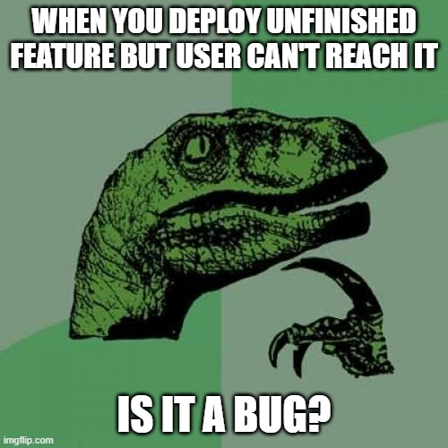

- title : CI/CD presentation
- description : Introduction to CI/CD by examples
- author : Robert Sęk/Damian Płaza
- theme : night
- transition : default

***
### Let's introduce <del>"Agile"</del> "Continuous" into our project...

About CI/CD on real example


***

### About "great success" project (dark side)
> "As A user when I enter the application I want to be able to check the weather"

- Main product 
- New feature request (Weather)
- Two external consultants hired for this job
- They interpreted user story as they wanted to
- No continuos integration or deployment. They used FileZilla to push the code to the cloud
- Unsatisfied customers stared to quit agreements
- Company started to have real problems...


***

### About "great success" project (there is hope)

Two braves developers said they may know the solution, but they need to start it from scratch....

***

### Event storming session
Now some event storming is happening...


***
### It's time for implementation
Finally when event storming session is finished and all requirements are clear we can start implementation...

***
### Delivery vs Deployment
- Continuos delivery means make code available to be deployed.
- Continuos deployment - when change passed the tests it's automatically deployed to customer. 

***
### Why initially it failed? 
- User story used as a requirement
- No CI/CD means no code review, tests, possibility to quick revert changes and **no agility**


***

### New feature for new customer 
- New customer **EllevioN**
- They want to have picture describing weather 
- They have their API designed to provide weather picture
- **Currently only this customer will use that feature...**


---

### Start with understanding the problem you're goin' to solve...
Now some event storming is happening...


***

***

### New feature - experimenting with something that might bring value
- business doesn't yet know how it might work
- it is a discovery process
- in order to check if it makes sense, someone has an idea
to test it using A/B method on real users

---



---

### Feature toggling to the rescue!

---

### And remember...

---

### ...Start next continuous journey with Event Storming

***

### Summary
* when one closely examines *agile* word then it resembles *continuous*
* to be *agile* one needs to be able to deliver value - this cannot be done without being able
to *continuously* release software
* *continuous* releasing gives space to experimentation
* sometimes to *continuously* release one needs to have some branching of the software
* the best if done in the code, not via git branches (worth mentioning it isn't flawless) - here
feature toggling kicks in

---

### Case from production trenches
* in FI we had a support case for Agder today - assignments didn't got synced
* turned out that the customer ordered big group (3500+ assignments)
* hypothesis was put on using "old" endpoints not being able to handle this amount
* FI sync has feature versioning in the code - we have V1 and V2 versions literally in the code

---
### Selectable via configuration
```json5
{
    "maintenanceApiUrlEndpoint": "/job-groups/assigned/FIELD",
    "fieldApiUrlEndpoint": "assignment-group",
    "isNewSyncFlow": "true",
    "fieldApiUrl": "https://field-maintenance-api-prod.azurewebsites.net/api/v2/teams/"
}
```

---

### Interpreted to give meaning
```fsharp
type AssignmentSynchronizationVersion = V1 | V2
        
let fromVersionedEndpointVariable (variable: VersionedEndpointVariables) =
    match variable.IsNewSyncFlow with
    | true -> V2
    | false -> V1
```

---

### Handled properly to bring versionable feature


---

### Enabling v2 version of sync
* it was done almost in "runtime"
* immediately started working

---

### Why feature versioning?
* it was Ellevio who was the main driver to have v2 version of sync
* other customers were not ready
* we didn't want to have two separate branches for v1 and v2 - only one pipeline (out of 9 in total) had to be versioned
* having feature versioning in the code can be reviewed, we see history of changes, etc.
* now we are able to roll out v2 even when entire pipeline is running


***
### The Reality of a Developer's Life 

**When I show my boss that I've fixed a bug:**
  

  
**When your regular expression returns what you expect:**
  

  
*from [The Reality of a Developer's Life - in GIFs, Of Course](http://server.dzone.com/articles/reality-developers-life-gifs)*

