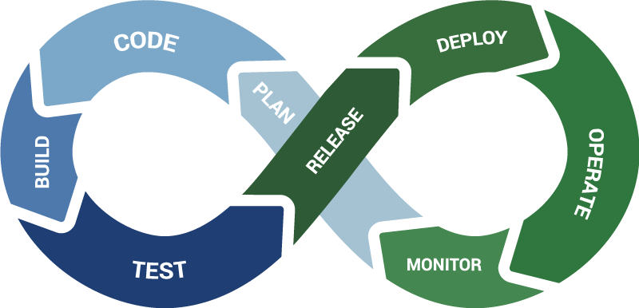

- title : CI/CD presentation
- description : Introduction to CI/CD by examples
- author : Robert Sęk/Damian Płaza
- theme : night
- transition : default

***
### Let's introduce <del>"Agile"</del> "Continuous" into our project...

About CI/CD on real example

***

### About "great success" project (dark side)
> "As A user when I enter the application I want to be able to check the weather"

- Main product 
- New feature request (Weather)
- Two external consultants hired for this job
- They interpreted user story as they wanted to
- No continuos integration or deployment. They used FileZilla to push the code to the cloud :smile:
- Unsatisfied customers stared to quit agreements
- Company started to have real problems...

***

### About "great success" project (there is hope)

Two braves developers said they may know the solution, but they need to start it from scratch....

***

### Event storming session
Now some event storming is happening...

***
### It's time for implementation
Finally when event storming session is finished and all requirements are clear we can start implementation...

***
### Delivery vs Deployment
- Continuos delivery means make code available to be deployed.
- Continuos deployment - when change passed the tests it's automatically deployed to customer. 

***
### Why initially it failed? 
- User story used as a requirement
- No CI/CD means no code review, tests, possibility to quick revert changes and **no agility**

***

### New feature for new customer 
- New customer **EllevioN**
- They want to have picture describing weather 
- They have their API designed to provide weather picture
- **Currently only this customer will use that feature...**

***

### The Reality of a Developer's Life 

**When I show my boss that I've fixed a bug:**
  

  
**When your regular expression returns what you expect:**
  

  
*from [The Reality of a Developer's Life - in GIFs, Of Course](http://server.dzone.com/articles/reality-developers-life-gifs)*

